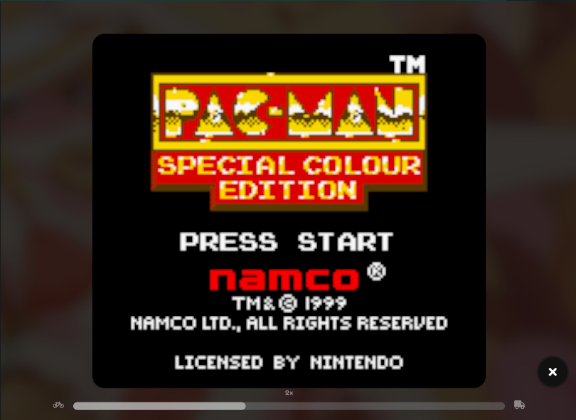
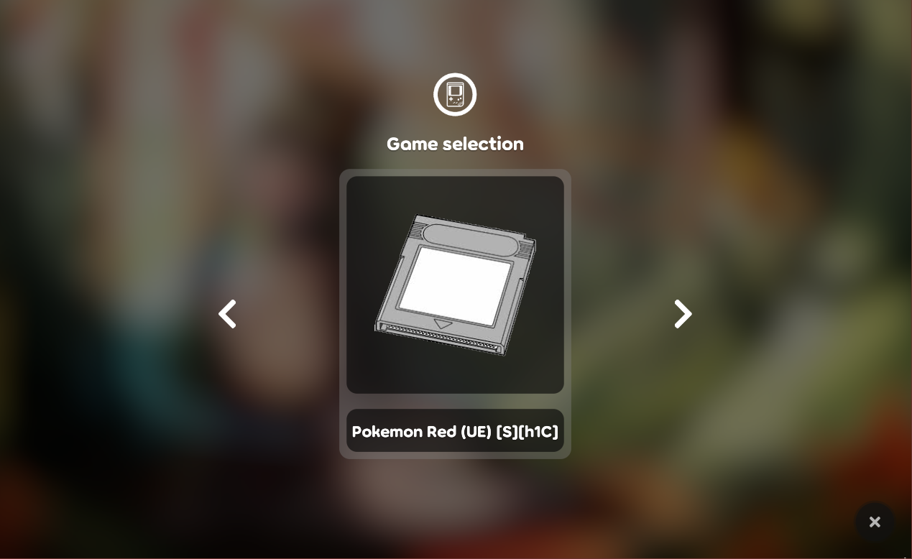

<div align="center">

<br>
<br>
A ruleset that adds a playable gameboy to osu!lazer.
</div>

# **DISCLAIMER**

This ruleset is still a _work in progress_ as there are still some features missing and there are bugs out. Prebuilt pre-releases will be provided along the developpement in the wait for an official release. Please _report any issues you are running into_ with this ruleset on the issue tracker of _this repository_.

## Screenshots
| | 
|--| --|

# Installation 

The ruleset consists of a single DLL file that you'll have to drop in the `rulesets` directory of your osu!lazer data directory.

Prebuilt releases are available if you do not have an development environement setup in place:
| [Releases](https://github.com/Game4all/gamebosu/releases) |
|--------|

Or you can alternatively build the ruleset yourself by issuing the following commands in your OS shell (_this assumes you've got the .NET Core SDK tools as well as git in your PATH_):

## Building instructions

```bash
    git clone https://github.com/Game4all/gamebosu
    cd osu.Game.Rulesets.Gamebosu
    dotnet build -c:Release # make sure to build ruleset in release mode to create a single file assembly
    # You should find the output assembly in osu.Game.Rulesets.Gamebosu/bin/Release/osu.Game.Rulesets.Gamebosu.Packed.dll   
```

For building this from an IDE, you should open the solution file with your prefered C# editor and hit `build` with the `Release` configuration (in order to create a single file assembly).

## Installation instructions

1. Navigate to your osu!lazer data directory. You can do so by opening the settings panel in osu!lazer and clicking on the "open osu! folder" button. Alternatively you can directly navigate to the rulesets directory via your OS directory explorer at the following locations:

   * `%AppData%/osu/rulesets` on Windows
   * `~/.local/share/osu/rulesets` on Linux / mac OSX

**NOTE:** If you have relocated your osu! data directory to another directory, the rulesets directory will be there instead.

2. Drag and drop the ruleset's DLL file into the `rulesets` directory.

3. Have fun! You may need to head periodically to the releases page to download the latest version of the ruleset as compatibilty may break with a new lazer update. You may want to also read [**Installing Roms**](#Installing-Roms) section before using the ruleset.

# Installing Roms

In order for the ruleset to correctly work, you'll need to download original gameboy or gameboy color ROM files and place them in a `roms` directory inside your osu!lazer data directory (you may have to launch the ruleset once in order for the directory to appear.)

# Acknowledgements

This ruleset uses [Emux](https://github.com/Washi1337/Emux) by _Washi1337_ as its emulation core.

Original idea of running a gameboy emulator on o!f : [osu-GameBoy](https://github.com/osu-Karaoke/osu-GameBoy)